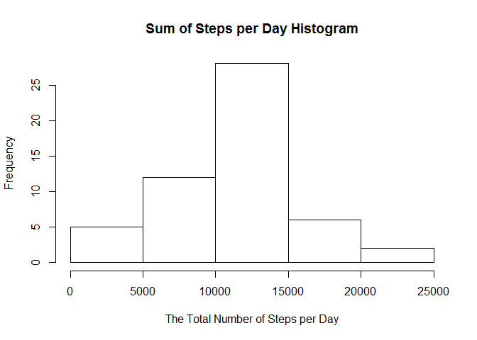
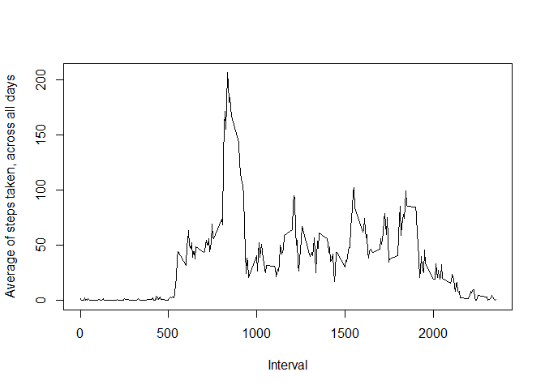
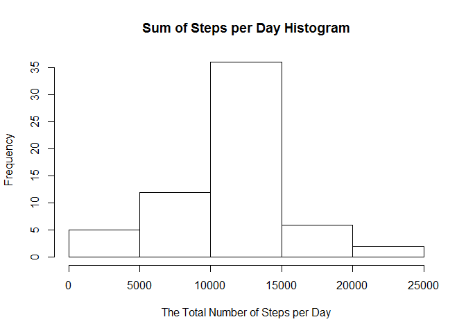
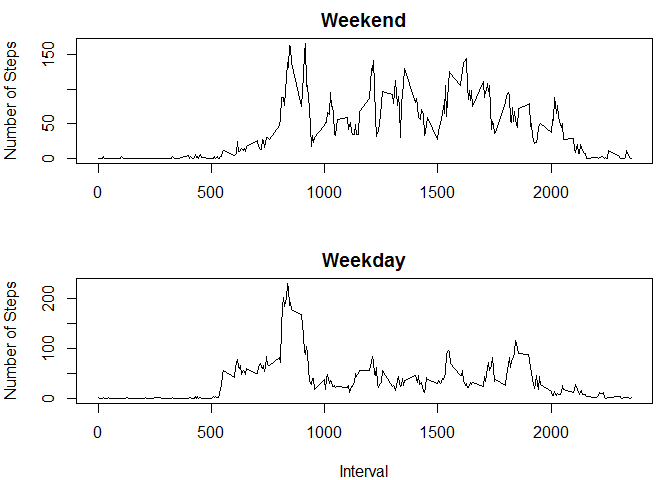

# Reproducible Research: Peer Assessment 1
  
  
## Loading and preprocessing the data
1. we changed the working directory to where the activity data is.

```r
options(digits=7)
getwd()
```

```
## [1] "C:/Users/yiwang/Documents/RepData_PeerAssessment1"
```

```r
setwd("C://Users/yiwang/Documents/RepData_PeerAssessment1")
```

2. we loaded the activity data.

```r
dt<-read.csv("activity.csv", header=T)
```


## What is mean total number of steps taken per day?
1. Calculate the total number of steps taken per day

```r
sum_steps=aggregate(steps ~ date, data=dt, sum)
```

2. Make a histogram of the total number of steps taken each day

```r
hist(sum_steps[,2], main="Sum of Steps per Day Histogram", 
     xlab='The Total Number of Steps per Day')
```

 

3. Calculate the mean and median of the total number of steps per day, and we find mean=10770 and median=10760

```r
summary(sum_steps[,2])
```

```
##    Min. 1st Qu.  Median    Mean 3rd Qu.    Max. 
##      41    8841   10760   10770   13290   21190
```


## What is the average daily activity pattern?
1. Calculate the average steps taken by different intervals, averaged across all days

```r
avgsteps=aggregate(steps ~ interval, data=dt, mean)
```
2. Make a time series plot (i.e. type = "l") of the 5-minute interval (x-axis) and the average number of steps taken, averaged across all days (y-axis)


```r
plot(avgsteps$interval, avgsteps$steps, type="l", 
     xlab="Interval", ylab="Average of steps taken, across all days")
```

 

3. Find the interval which has the maximum number of steps

```r
avgsteps[which(avgsteps$steps==max(avgsteps$steps)),1]
```

```
## [1] 835
```


## Imputing missing values
1. calculate the total number of missing values in the dataset as below and we find there are 2304 NA values in column steps.

```r
summary(dt)
```

```
##      steps                date          interval     
##  Min.   :  0.00   2012-10-01:  288   Min.   :   0.0  
##  1st Qu.:  0.00   2012-10-02:  288   1st Qu.: 588.8  
##  Median :  0.00   2012-10-03:  288   Median :1177.5  
##  Mean   : 37.38   2012-10-04:  288   Mean   :1177.5  
##  3rd Qu.: 12.00   2012-10-05:  288   3rd Qu.:1766.2  
##  Max.   :806.00   2012-10-06:  288   Max.   :2355.0  
##  NA's   :2304     (Other)   :15840
```

2. Impute missing data with the average steps of the same interval, and save the new data with imputed missing values as dataset dtn

```r
#find the index list for all missing values
NAind=which(is.na(dt$steps))
dtn=dt
#use a for loop to impute all missing values with the average steps of the same interval
for (i in 1:length(NAind)){
    dtn[NAind[i],1]=avgsteps[which(avgsteps$interval==dt[NAind[i],3]),2]
}
```

3. Calculate the sum of steps per day in the new dataset dtn, and make a histogram of the total number of steps

```r
sum_steps1=aggregate(steps ~ date, data=dtn, sum)

hist(sum_steps1[,2], main="Sum of Steps per Day Histogram",
     xlab="The Total Number of Steps per Day")
```

 
Calculate the mean and median of steps in the new dataset and the old dataset as below.

```r
#Calculate the mean and median of the new dataset
summary(sum_steps1[,2])
```

```
##    Min. 1st Qu.  Median    Mean 3rd Qu.    Max. 
##      41    9819   10770   10770   12810   21190
```

```r
#Calculate the mean and median of the old dataset
summary(sum_steps[,2])
```

```
##    Min. 1st Qu.  Median    Mean 3rd Qu.    Max. 
##      41    8841   10760   10770   13290   21190
```
There is no difference in mean but there is difference in median. The median of the new dataset is 10770 which is the same as the mean, while the median of the old dataset is 10760, which is smaller than the mean. Thus, imputing missing data makes the steps data look more symmetric.


## Are there differences in activity patterns between weekdays and weekends?
1. add a new factor to indicate weekday and weekend

```r
dtn$date=as.Date(dtn$date)
dtn$weekday=""
for (i in 1:dim(dtn)[1]){
    if (weekdays(dtn[i,2])=="Saturday"|weekdays(dtn[i,2])=="Sunday"){
        dtn[i,4]="weekend"
    }else{
        dtn[i,4]="weekday"
    }
}
```
2. calculate avgsteps for weekday and weekend separately,and make panel plots

```r
dtn_wday=subset(dtn, dtn$weekday=="weekday")
dtn_wknd=subset(dtn, dtn$weekday=="weekend")
avg_wday=aggregate(steps~interval, data=dtn_wday, mean)
avg_wknd=aggregate(steps~interval, data=dtn_wknd, mean)
# make panel plots using basic plotting system
par(mfrow=c(2,1), mar=c(4,4,2,1))
plot(avg_wknd$interval, avg_wknd$steps, type="l", main="Weekend", ylab="Number of Steps", 
     xlab="")
plot(avg_wday$interval, avg_wday$steps, type="l", main="Weekday", ylab="Number of Steps", 
     xlab="Interval")
```

 

